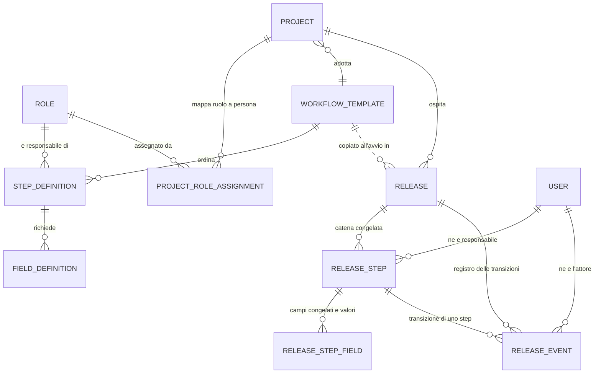
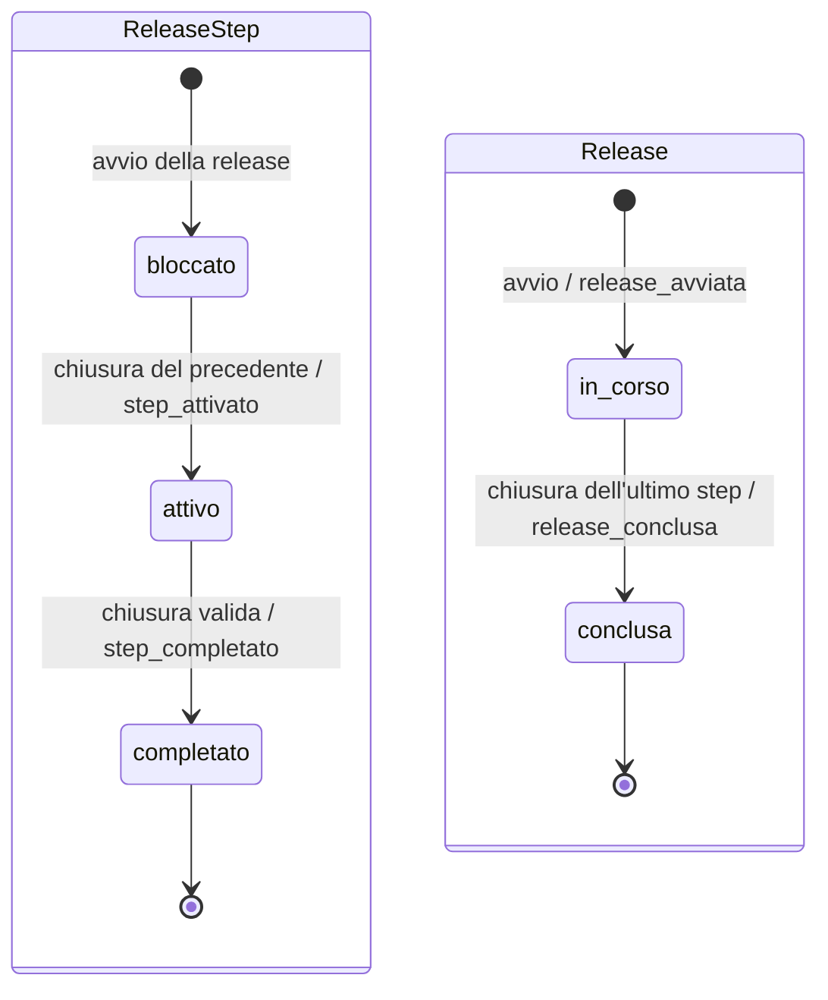

# Exin Deploy

Strumento interno per orchestrare il processo di rilascio in produzione su un team
distribuito. Ogni rilascio apre un'istanza di workflow: una catena ordinata di step,
ciascuno con un responsabile e una checklist di informazioni obbligatorie. Lo step si
chiude solo quando quelle informazioni esistono, e solo allora il flusso passa al
responsabile successivo.

Lo strumento **orchestra persone**: non esegue deploy, non tocca i server, non conserva
credenziali di terzi.

Contratto di prodotto: [`.larapilot/docs/PRD.md`](.larapilot/docs/PRD.md).
Backlog: [`.larapilot/backlog.yaml`](.larapilot/backlog.yaml).

## Prerequisiti

- PHP **8.4** con estensione sodium (necessaria per l'hashing Argon2id)
- Composer
- Node 20+ e npm
- [Laravel Herd](https://herd.laravel.com) per l'ambiente locale

## Avvio locale

Il progetto e servito da **Herd**: il sito e sempre raggiungibile su
`http://exin-deploy.test`, non serve avviare alcun server a mano.

```bash
composer install
npm install

cp .env.example .env
php artisan key:generate

touch database/database.sqlite
php artisan migrate:fresh --seed

npm run dev        # oppure: npm run build
```

Il seeder crea il team dimostrativo. Tutti gli account condividono la password
`Rilascio-2026!`; l'amministratore e `f.giarola@gruppoexcellence.com`. Un membro
(`p.venturi@gruppoexcellence.com`) e volutamente **disattivato**, per poter verificare
il rifiuto dell'accesso.

Semina inoltre la configurazione di processo: cinque ruoli funzionali, la mappatura
predefinita del team e due progetti. Uno dei due (`gestionale-magazzino`) ha una
sostituzione rispetto alla predefinita, cosi che la differenza fra le due mappature sia
visibile senza doverla ricreare a mano.

E semina il processo di rilascio: il template **"Rilascio standard"**, attivo e
predefinito, con cinque step ordinati (Preparazione del codice, Verifica funzionale,
Valutazione di sicurezza, Preparazione dell'ambiente, Consegna in produzione) e quattordici
campi richiesti che coprono tutti e quattro i tipi previsti. Entrambi i progetti lo usano.
Un secondo template, **"Rilascio urgente"**, e disattivato: serve a vedere come si comporta
l'elenco e come si sostituisce il processo su un progetto.

La mappatura dimostrativa copre tutti i ruoli previsti dal template, quindi lo stato
iniziale e quello sano. Per vedere la segnalazione dei **ruoli scoperti**, rimuovi un
responsabile dalla pagina dei responsabili di un progetto.

Lo scenario di **esecuzione** — release in corso, release conclusa — arriva con US-011.

Non ci sono istruzioni Sail o Docker: l'ambiente locale scelto nel PRD e Herd.

## Variabili d'ambiente rilevanti

| Variabile | Valore | Perche |
| --- | --- | --- |
| `HASH_DRIVER` | `argon2id` | Baseline di sicurezza del progetto: mai bcrypt su un progetto nuovo |
| `DB_CONNECTION` | `sqlite` | Scelta del PRD, con il rischio di concorrenza in scrittura accettato |
| `DB_JOURNAL_MODE` | `WAL` | Consente letture concorrenti durante una scrittura |
| `DB_BUSY_TIMEOUT` | `5000` | Attende invece di fallire subito quando il file e bloccato |
| `DB_SYNCHRONOUS` | `NORMAL` | Compromesso fra durabilita e velocita adeguato a WAL |
| `APP_LOCALE` | `it` | Lingua unica del prodotto |
| `APP_FALLBACK_LOCALE` | `en` | Una stringa di framework non tradotta rende in inglese, non come chiave grezza |
| `MAIL_MAILER` | `log` | In locale le email di recupero password finiscono in `storage/logs` |

## Comandi

```bash
php artisan test --compact                 # suite completa
php artisan test --compact --filter=Auth   # sottoinsieme

php artisan larapilot:quality              # Pint + Larastan livello 5
php artisan larapilot:quality --fix        # applica la formattazione

php artisan migrate:fresh --seed           # ricrea il database dimostrativo
```

Prima di ogni commit: `vendor/bin/pint --dirty` e Larastan a livello 5. Il livello
non va abbassato senza una deroga umana registrata nel PRD o nel piano.

## Architettura

### Definizione e istanza sono separate

E la scelta portante del sistema, e la parte che chi arriva fraintende.

**Definizione** — la configurazione riusabile: ruoli funzionali, progetti, mappature
ruolo → persona, template di workflow con i loro step e i campi richiesti.

**Istanza** — un rilascio concreto: la release, i suoi step, i valori forniti, il
registro degli eventi.

Le due non condividono tabelle. All'avvio di una release, step e campi del template
vengono **copiati** nell'istanza (snapshot congelato). Da quel momento:

> il codice di esecuzione di una release legge **soltanto** il proprio snapshot,
> mai le tabelle di definizione.

Senza questa regola, modificare un template mentre tre release sono in corso ne
cambierebbe la forma sotto i piedi, e lo storico dei rilasci diventerebbe inattendibile:
non si potrebbe piu sapere cosa fosse stato effettivamente richiesto in un rilascio
passato. Le release concluse sono la prova documentata che il processo e stato rispettato,
e una prova che cambia retroattivamente non e una prova.

Da US-004 le due meta esistono entrambe, e la separazione non e piu una promessa ma uno
schema. Le entita di istanza:

| Entita | Contenuto | Regole |
| --- | --- | --- |
| `Release` | rilascio avviato su un progetto | etichetta univoca **per progetto** a schema; stati `in_corso` e `conclusa`; mai cancellabile |
| `ReleaseStep` | copia congelata di uno step del template | unicita `(release, posizione)` a schema; nome del ruolo congelato accanto alla chiave esterna; al massimo **uno** attivo per release |
| `ReleaseStepField` | copia congelata di un campo richiesto, e il valore fornito | unicita `(step, posizione)` a schema; una sola colonna `value` per tutti e quattro i tipi |
| `ReleaseEvent` | registro delle transizioni | **sola aggiunta**: una riga scritta non si modifica e non si cancella |

Cosa e congelato e cosa no:

| Congelato all'avvio | Riferimento vivo |
| --- | --- |
| forma della catena: numero, ordine, nomi e istruzioni degli step | identita delle **persone** (`assigned_user_id`) |
| etichetta, tipo, obbligatorieta e testo di aiuto di ogni campo | identita del **progetto** |
| **nome** del ruolo responsabile (`role_name`) | — |

La distinzione ha una ragione: rinominare un ruolo o riordinare un template non deve
riscrivere il passato, mentre una persona che cambia cognome deve comparire nello storico
con il proprio nome attuale — e la stessa persona, non un nome fossile.

La regola operativa e verificata da test che ascoltano le query eseguite mentre si **legge**
una release e mentre si **chiude uno step**: se ne compare una su `workflow_templates`,
`step_definitions`, `field_definitions` o `project_role_assignments`, il test fallisce.
Altri due test cancellano gli step di definizione e verificano che la release resti
leggibile per intero e che la catena avanzi comunque.

Regole correlate, applicate dal codice: la chiusura di uno step, l'attivazione del
successivo e la scrittura degli eventi avvengono in **una sola transazione**, e una release
ha al massimo **uno** step attivo per volta.

### Le due meta dello schema

Il diagramma distingue i due gruppi. L'unica freccia tratteggiata e il **confine**: la
copia che avviene all'avvio di una release. Non ci sono frecce di lettura che tornano
dall'istanza alla definizione — i riferimenti che restano (`workflow_template_id`,
`role_id`) dicono da dove la release e nata e rendono quelle righe non cancellabili,
ma nessun percorso di esecuzione li segue per decidere come procedere.



### La macchina a stati

Ogni transizione e annotata con l'evento che scrive nel registro: il registro non e un
racconto a parte, e la traccia delle stesse frecce.



Cosa il diagramma non ammette, ed e voluto: nessuna freccia **torna** indietro — la
riapertura di uno step e FR-019, rinviata oltre l'MVP — e non esiste uno stato
"saltato", perche il PRD non prevede di scavalcare un passaggio. `conclusa` e uno stato
terminale in senso stretto: una release conclusa e in sola lettura per chiunque,
amministratori inclusi, e nessuno step torna compilabile.

### Avvio di una release

Un amministratore avvia una release da un progetto, indicando un'etichetta
(`v2.4.0`, `2026.08.1`, ...). L'avvio passa da **un solo percorso**,
`App\Actions\Releases\StartRelease`, e avviene in **una sola transazione**.

Le precondizioni sono verificate in quest'ordine, tutte **prima** di qualsiasi scrittura:

1. il progetto e attivo — un progetto disattivato non accoglie nuove release;
2. il progetto ha un template, e il template e utilizzabile (`isUsable()`: attivo e con
   almeno uno step). Il motivo del rifiuto distingue "disattivato" da "senza step";
3. ogni ruolo previsto dagli step ha un responsabile sul progetto — i ruoli scoperti sono
   **nominati** nel rifiuto;
4. nessuno dei responsabili risolti e disattivato — anche qui, nominati.

Poi, nella stessa transazione: la release nasce `in_corso` con autore e istante, step e
campi vengono copiati in **due sole scritture di massa**, il primo step risulta `attivo` e
gli altri `bloccato`, e il registro riceve l'evento `release_avviata`. Il costo in query
non dipende dalla lunghezza della catena, ed e vincolato da un test.

L'ordine dei rifiuti non e casuale: si vede il secondo problema solo dopo aver risolto il
primo, quindi elencarli tutti insieme non aiuterebbe.

`Project::startBlocker()` anticipa lo stesso giudizio dove serve mostrarlo — la schermata di
avvio e l'elenco progetti, che disabilita il comando con il motivo accanto. Anticipa, non
sostituisce: l'Action decide comunque sul dato fresco, e il suo rifiuto viene reso come
messaggio e mai come errore tecnico.

**Il doppio invio non produce due release.** Non serve un lock pessimistico: qui non c'e
uno stato preesistente da leggere e riscrivere, e l'unicita `(project_id, label)` a livello
di schema fa fallire la seconda transazione, che non lascia nulla dietro di se. Il lock
richiesto da `.ai/rules/app.md` riguarda l'**avanzamento**, dove invece lo stato c'e.

### Chiusura di uno step e avanzamento

Il responsabile dello step attivo compila i campi congelati e lo chiude; il flusso passa
al responsabile successivo. L'avanzamento passa da **un solo percorso**,
`App\Actions\Releases\CloseStep`, e avviene in **una sola transazione**.

I controlli sono in quest'ordine, e l'ordine non e casuale:

1. la release e in corso;
2. lo step e **attivo** — bloccato e completato sono due rifiuti distinti, perche il
   primo si aspetta e il secondo si legge;
3. i valori forniti soddisfano cio che lo step chiede.

Prima lo stato, poi i valori: validare per primo farebbe correggere un form che comunque
non si sarebbe potuto chiudere.

Le regole per tipo vivono su `ReleaseStepField::closingRules()`, accanto al dato
congelato: testo breve fino a 255 caratteri, testo lungo fino a 5000, link fino a 2048 e
validato da `App\Rules\WellFormedLink`, conferma obbligatoria da accettare. Ogni elenco
apre con `bail`, cosi che un campo non produca due messaggi per lo stesso difetto.
`WellFormedLink` **nomina i difetti trovati** ("manca lo schema (https://) e contiene uno
spazio") invece di dire "non valido": chi incolla un indirizzo da una chat perde lo schema
e si porta dietro uno spazio, e scoprire il secondo problema solo dopo aver corretto il
primo e la stessa informazione data nel momento peggiore. La **raggiungibilita** non viene
verificata: sarebbe una chiamata di rete dentro una validazione, e i report interni a cui
questi campi rimandano non sono raggiungibili dal server.

Un campo lasciato vuoto diventa `null` e non stringa vuota
(`ReleaseStepField::normalizeValue()`): il dettaglio della release deve poter dire "non
fornito", e `''` e un valore fornito che si dava il caso fosse vuoto.

**Il doppio invio non produce due avanzamenti.** La chiusura e un **compare-and-swap**:
un solo `update()` condizionato a `status = attivo`. Zero righe aggiornate significa che
un'altra transazione e passata prima, e allora l'intera transazione viene annullata —
nessun valore scritto, nessun evento. Il lock pessimistico sulla riga della release
richiesto da `.ai/rules/app.md` c'e, e i due **non** sono ridondanti: su SQLite
`lockForUpdate()` non produce SQL (la grammatica non supporta `FOR UPDATE`), quindi la
garanzia effettiva li e l'update condizionato — l'alternativa prevista dall'invariante 3
del PRD; su MySQL e PostgreSQL il lock serializza davvero, e il vincolo di portabilita
impone che il codice resti corretto su tutti e tre. Togliere il secondo perche "c'e il
lock" romperebbe proprio l'ambiente su cui il prodotto gira.

**Quando lo step chiuso e l'ultimo, la release e consegnata.** La conclusione non e un
percorso a parte: avviene dentro la stessa transazione della chiusura, sul ramo terminale
di `CloseStep` — la release passa a `conclusa` con autore e istante della consegna, e il
registro riceve `release_conclusa` dopo `step_completato`. Anche qui la scrittura e un
compare-and-swap condizionato a `in_corso`, per lo stesso motivo dell'update sullo step:
due invii dell'ultimo passaggio producono **una sola** conclusione. Non e stata estratta
in una Action pubblica proprio per questo: una `CompleteRelease` invocabile dall'esterno
sarebbe un secondo percorso di scrittura sullo stato della release, cioe l'opposto
dell'invariante che questa transazione tiene.

Una release conclusa **esce da quelle in corso** e resta consultabile a tempo
indeterminato, in sola lettura: `ReleaseStepPolicy` nega `fill` e `close` a chiunque —
sono le due ability che il filtro `before()` non decide, quindi il divieto vale anche per
un amministratore — mentre `view` resta consentita, altrimenti la conclusione renderebbe
illeggibile proprio cio che esiste per conservare. La riapertura di uno step resta fuori
perimetro (FR-019), e nessun testo dell'interfaccia lascia intendere il contrario.

**Invariante:** al massimo uno step attivo per release, zero solo quando la release e
conclusa. E verificato da test lungo l'intera catena, non su un singolo passaggio, e il
caso "zero" ha la sua prova sulla release conclusa.

**Salvare senza chiudere** e un'azione separata (`App\Actions\Releases\SaveStepValues`):
accetta un form incompleto, non fa avanzare nulla e **non scrive nel registro** — il
registro documenta le transizioni (FR-016), e una bozza non lo e. Le regole di forma sono
derivate da `closingRules()` con l'obbligatorieta rilassata, non riscritte: un link
malformato viene rifiutato anche in bozza, perche salvarlo significherebbe riproporlo
identico e rotto alla ripresa.

**La rotta di chiusura non porta un `->can()`**, unica in tutta l'applicazione, ed e una
deroga dichiarata alla protezione a due livelli. Il criterio di accettazione chiede che un
tentativo non autorizzato sia **registrato** nel log applicativo e nel registro delle
transizioni, e il middleware rifiuta prima che il codice applicativo possa scrivere quella
riga. Il controllo resta pieno e vive nel componente: `authorizeOrRecord()` registra e poi
rifiuta con 403, al montaggio e su **ogni** azione. Nel registro entrano solo i tentativi
mutanti (`fill`, `close`): un `view` negato produce la voce di log e si ferma li, perche il
registro non e cancellabile e un ricaricamento di indirizzo lo gonfierebbe di righe che non
dicono nulla su come e andato il rilascio.

`ReleaseStepPolicy` decide chi puo agire: il responsabile assegnato o un amministratore, e
solo mentre lo step e attivo su una release in corso. `fill` e `close` stanno **fuori** dal
filtro `before()`: il vincolo dello step attivo vale anche per un amministratore, perche
quello non sarebbe un privilegio ma la catena che smette di descrivere l'ordine in cui il
rilascio e avvenuto.

### Schermate

| Rotta | Pagina | Accesso |
| --- | --- | --- |
| `/` | **I miei step** — schermata di ingresso | ogni membro |
| `/impostazioni/sicurezza` | Verifica in due passaggi | ogni membro |
| `/membri` | Membri del team | amministratore |
| `/ruoli` | Ruoli funzionali | amministratore |
| `/progetti` | Progetti, con il comando di avvio release per riga | amministratore |
| `/progetti/{progetto}/responsabili` | Mappatura ruolo → persona del progetto | amministratore |
| `/progetti/{progetto}/rilascio` | **Avvio di una release** | amministratore |
| `/rilasci` | **Elenco e storico delle release** — in corso e concluse, con filtri | ogni membro |
| `/rilasci/{release}` | **Dettaglio della release** — catena, responsabili, valori | ogni membro |
| `/step/{step}` | **Compilazione e chiusura di uno step** | responsabile dello step o amministratore |
| `/template` · `/template/{t}/step` · `/template/{t}/step/{s}/campi` | Processo di rilascio | amministratore |
| `/responsabili-predefiniti` | Mappatura predefinita di team | amministratore |

Nessuna voce della navigazione e piu marcata "in arrivo": ogni sezione della sidebar porta a
una pagina che esiste. Le due schermate che **non** compaiono in navigazione si raggiungono
da dove servono e non da un menu — l'avvio di una release dal progetto su cui si rilascia, la
chiusura di uno step da "i miei step" o dal dettaglio.

`/step/{step}` si raggiunge dalla schermata di ingresso e dalla catena mostrata dopo
l'avvio. La pagina rende tre stati diversi dello stesso step — attivo con il form,
completato in sola lettura, bloccato con l'indicazione di chi si sta aspettando — perche
chi arriva da un collegamento salvato non sa in quale stato lo trovera.

#### La schermata di ingresso: "i miei step"

**Non e una dashboard di grafici**, ed e una scelta di prodotto: senza notifiche (FR-025,
fuori perimetro) questa pagina e il posto in cui si scopre che qualcosa e fermo su di te.
La compongono due query, entrambe sullo snapshot congelato:

1. **Gli step che ti attendono** — `ReleaseStep::awaitingUser($user)`: step in stato attivo
   assegnati a chi guarda, su release in corso, con release, progetto e lunghezza della
   catena in eager loading (`withCount('steps')` da il denominatore di "Step 2 di 5").
   Il filtro e **sull'assegnazione e non sulla Policy**: `ReleaseStepPolicy` concede a un
   amministratore la lettura di qualunque step, ma questa schermata si chiama "i miei step"
   e mostrargli anche quelli altrui la trasformerebbe in un cruscotto di sorveglianza.
2. **Le release in attesa di altri** — `Release::inProgress()->involving($user)` meno quelle
   il cui step attivo e tuo, con `activeStep` e il suo responsabile in eager loading. E la
   mitigazione del rischio accettato n.1 del PRD: dice **chi** trattiene il flusso e **da
   quanto**, cosi che chiunque possa sollecitare invece di scoprire il blocco a valle.

**Da quanto uno step e aperto: derivato, non memorizzato.** Non esiste una colonna
`release_steps.activated_at`, e non per dimenticanza. `CloseStep` chiude lo step precedente
e attiva il successivo **nella stessa transazione**: il `completed_at` del precedente **e**
l'istante di attivazione di questo, per costruzione e non per approssimazione. Sul primo
della catena non c'e un precedente, e l'istante e `release.started_at`, che `StartRelease`
scrive creando gia attivo lo step in posizione 1.

Lo legge lo scope `ReleaseStep::withActivationInstant()` con una sottoquery correlata
(alias `previous_step_completed_at`, castato a `datetime`), piu `activationInstant()` che
applica il ripiego. Costo costante, nessun N+1, solo Eloquent portabile. Chiamare
`activationInstant()` senza lo scope **solleva un'eccezione** invece di ripiegare in
silenzio: una durata sbagliata e indistinguibile da una giusta a chi guarda la schermata.

L'alternativa scartata — una colonna `activated_at` scritta da `StartRelease` e `CloseStep`
— sarebbe piu diretta in lettura ma imporrebbe di riaprire due Action gia verificate contro
il doppio invio concorrente, piu un backfill, per un dato che i dati gia contengono. Quando
servira **ordinare o filtrare in database** su quell'istante (per esempio le metriche di
processo, FR-024), la colonna diventera giustificata: si aggiunge allora, con backfill nella
stessa migrazione.

**L'ordinamento dei due blocchi avviene in PHP**, ed e deliberato — con un limite noto.
Ordinare in database e possibile e portabile (`ORDER BY COALESCE(<sottoquery>,
releases.started_at)` con un join sulle release): non e vero che si sarebbe costretti a
ordinare sulla colonna nuda, dove la posizione dei `NULL` cambia da motore a motore. Solo,
qui non paga: l'insieme e quello che **una persona sola** tiene aperto, gia interamente
caricato, e riordinarlo in memoria non costa una query. Il limite e che i due blocchi **non
sono paginabili ne limitabili in database**: quando servira un elenco esteso o le metriche
di processo (FR-024), l'ordine va spostato in SQL insieme al resto.

`Release::activeStep()` e `ReleaseStep::withActivationInstant()` nascono qui ma sono **seam
condivisi**: il dettaglio della release riusa lo scope dell'istante di attivazione e l'elenco
(US-009) legge lo stesso stato. Vanno letti come tali e non come dettaglio interno di
questa schermata.

Finche US-011 non e consegnata, `migrate:fresh --seed` produce un ambiente **senza release**:
la schermata mostra lo stato vuoto, ed e corretto. Per provarla si avvia una release
dall'interfaccia (`/progetti/{progetto}/rilascio`).

#### Il dettaglio della release

`/rilasci/{release}` risponde alla domanda "dove siamo e chi stiamo aspettando" (FR-014):
l'intera catena nell'ordine congelato, con lo stato di ogni step, il ruolo congelato, il
nome del responsabile, e i valori forniti sugli step chiusi. E una schermata di **sola
lettura**: nessuna azione, nessun form, nessuna scrittura. L'unico comando presente porta
altrove — a `/step/{step}` — e compare solo dove `ReleaseStepPolicy::fill()` lo consente.

**La lettura e aperta a ogni membro autenticato**, anche a chi e estraneo alla catena.
`ReleasePolicy::view()` concede a chiunque sia autenticato, e da US-009 lo fa anche
`viewAny()`: le due **non** si sono allineate per uniformita — la decisione sull'elenco era
rinviata di proposito finche la schermata non esisteva, perche un'autorizzazione senza una
pagina che la applichi non si sa valutare. Cade dalla stessa parte per la stessa ragione:
sapere dove e fermo un rilascio non e un privilegio, su uno strumento che non invia
notifiche e la sua funzione. Restano negate `create` ai non amministratori e `delete` a
chiunque.

Una sola lettura di dominio, interamente in eager loading: progetto, template, autore
dell'avvio, e la catena con campi, responsabile e autore della chiusura. Due vincoli non
ovvi, entrambi coperti da `ReleaseDetailQueryBudgetTest`:

1. `withActivationInstant()` **ridefinisce la select** (`select('release_steps.*')`), quindi
   va applicato prima di qualsiasi altra aggiunta alla select: un `withCount` messo prima
   verrebbe cancellato senza avviso.
2. La **relazione inversa** verso la release va popolata a mano sugli step caricati
   (`setRelation('release', $release)`). Senza, il primo step della catena — quello che
   ripiega su `release.started_at` per sapere da quando e aperto — risalirebbe alla release
   con una query propria. `Release::activeStep()` ottiene lo stesso con `chaperone()`, che su
   una `HasMany` caricata da `load()` non e disponibile.

Le informazioni fornite di uno step chiuso sono rese da `x-releases.step-values`, condiviso
con la schermata di chiusura: dentro quel componente vive la verifica dello schema `http(s)`
prima di rendere un valore come collegamento cliccabile, e **due copie sarebbero due posti in
cui dimenticare di correggerla**. `WellFormedLink` garantisce lo schema in scrittura, ma una
riga arrivata da un import o da una correzione a mano sul database non passa da quella
regola.

Il nome del template mostrato nel riquadro dei dati e quello **attuale**, ed e citato come
provenienza e non come definizione: catena, ordine e campi arrivano tutti dallo snapshot. La
nota accanto lo dichiara a chi legge. Alternativa scartata: congelare `template_name` su
`releases`, una colonna in piu per un dato che nessun percorso di esecuzione interroga.

Le **briciole di navigazione** aprono sull'elenco delle release, conformi al mockup. La
deroga dichiarata da US-008 — quando l'elenco non esisteva e la prima voce ripiegava su "i
miei step" — e caduta con la schermata che la motivava.

#### L'elenco e lo storico delle release

`/rilasci` risponde alla domanda d'insieme (FR-015): quali rilasci sono aperti, su chi si
sono fermati, cosa e stato consegnato e quando. Sola lettura come il dettaglio.

**Due sezioni con colonne diverse**, e non e una duplicazione: quella in corso mostra step
corrente e responsabile in attesa, lo storico chi ha consegnato, quando e in quanto tempo.
Uniformarle lascerebbe meta tabella vuota in entrambe.

**Due ordinamenti diversi**, per la stessa ragione: una release aperta e "recente" se e stata
**avviata** da poco, una conclusa se e stata **consegnata** da poco. Ordinare lo storico su
`started_at` — la scorciatoia che sembra una pulizia — metterebbe in cima un rilascio avviato
a marzo e consegnato ieri, sotto uno avviato e consegnato ad aprile. Il caso e coperto da un
test con due release che si incrociano.

**I filtri vivono nell'indirizzo** (`?stato=`, `?progetto=`) e non nel solo stato del
componente: un elenco filtrato deve essere condivisibile e ricaricabile. Lo stato ha **tre**
valori — `tutte`, `in_corso`, `conclusa` — perche il mockup mostra un filtro che nasconde una
sezione, non un interruttore fra due schermate: senza il terzo non esisterebbe il ritorno
alla vista d'insieme. Un valore fuori vocabolario mostra tutto invece di far fallire il cast
a enum: il filtro arriva da un input non fidato.

**Nessuna paginazione, nessun limite di data.** Lo storico e consultabile a tempo
indeterminato per criterio di accettazione, e su un team interno cresce di qualche riga a
settimana; un paginatore su due sezioni indipendenti nella stessa pagina introdurrebbe due
parametri di pagina e due stati vuoti. Il costo di lettura **non dipende dal numero di
release** (`ReleaseIndexQueryBudgetTest`), e filtrare per stato risparmia davvero la lettura
della sezione nascosta. Quando lo storico raggiungera l'ordine delle centinaia la sezione
conclusa va paginata: e la stessa soglia oltre la quale l'ordinamento di "i miei step" va
spostato in SQL.

**Una sola tabella semantica per sezione.** Sotto 1024 px le utility `max-lg:` la impilano in
card — `thead` nascosto, righe a blocco, etichetta di colonna resa dal pseudo-elemento della
cella (`content-[attr(data-label)]`) — e sopra torna una tabella. Il contenuto **non** e
duplicato in due alberi DOM: uno screen reader lo leggerebbe due volte. Nessun
`overflow-x-auto` da nessuna parte: il criterio di accettazione esclude lo scorrimento
orizzontale a ogni larghezza, e un contenitore scorrevole sarebbe il modo piu facile per
rientrarci senza accorgersene. L'etichetta di colonna arriva dallo stesso array che genera
l'intestazione (`x-releases.list-cell`), quindi le due non possono divergere.

Nessuna deroga alla regola dello snapshot: a differenza del dettaglio, qui non compare
nemmeno il template di origine, e `SnapshotIsolationTest` verifica sulla pagina resa che
l'elenco non interroghi alcuna delle quattro tabelle di definizione.

Il comando "Avvia una release" del mockup **non** e stato portato in cima all'elenco: l'avvio
si decide su un progetto (`/progetti/{progetto}/rilascio`) e un comando senza progetto non
porterebbe da nessuna parte.

### Configurazione del processo

Le entita di definizione presenti oggi:

| Entita | Contenuto | Regole |
| --- | --- | --- |
| `Role` | ruolo funzionale (Dev Lead, QA, DevOps, ...) | nome univoco; non cancellabile se referenziato, sempre disattivabile |
| `Project` | progetto su cui si rilascia | slug univoco a livello di schema; mai cancellabile, solo disattivabile |
| `DefaultRoleAssignment` | ruolo → persona predefinita del team | una sola persona per ruolo |
| `ProjectRoleAssignment` | ruolo → persona su un progetto | una sola persona per coppia progetto/ruolo |
| `WorkflowTemplate` | processo di rilascio riutilizzabile | nome univoco; **un solo predefinito**; mai cancellabile, solo disattivabile |
| `StepDefinition` | passaggio ordinato del processo, con ruolo responsabile e istruzioni | posizioni **contigue e senza duplicati**, unicita `(template, posizione)` a schema |
| `FieldDefinition` | informazione richiesta per chiudere uno step | **quattro tipi** (testo breve, testo lungo, link, conferma); unicita `(step, posizione)` a schema |

**Il template nomina ruoli, non persone.** E cio che rende lo stesso processo utilizzabile
su progetti con team diversi: la persona si ottiene all'avvio della release, risolvendo il
ruolo di ogni step sulla mappatura del progetto. Un ruolo previsto dal template e senza
responsabile sul progetto e segnalato in elenco progetti e nella pagina dei responsabili,
perche una release avviata cosi si bloccherebbe su quello step.

**Un template senza step non e utilizzabile.** `WorkflowTemplate::isUsable()` e
`unusableReason()` distinguono "disattivato" da "senza step": sono due situazioni che si
risolvono in modo diverso, e un messaggio unico costringerebbe a indovinare. E lo stesso
metodo che `StartRelease` invoca come precondizione dell'avvio: la regola e scritta una
volta sola.

**Il template predefinito e una proposta, non un legame.** Alla creazione di un progetto
viene proposto come valore iniziale e resta sostituibile, in creazione e in modifica —
stessa semantica della mappatura predefinita di team. Cambiare il predefinito non tocca i
progetti gia creati.

**Il riordino e affidato a un concern condiviso.** `App\Models\Concerns\OrderedByPosition`,
usato da step e campi, garantisce che dopo ogni spostamento o cancellazione le posizioni
restino `1..N`. La rinumerazione avviene in due passaggi dentro una sola transazione,
passando da posizioni **temporanee negative**: senza quel passaggio intermedio l'indice
unico rifiuterebbe la scrittura a meta strada. Per questo `position` e un `integer` con
segno. Ogni cancellazione passa da `deleteAndResequence()`: la contiguita non e
responsabilita di chi chiama.

**La mappatura predefinita non e retroattiva.** Alla creazione di un progetto,
`App\Actions\Projects\CreateProject` copia la mappatura predefinita sul progetto, dentro una
sola transazione. Da quel momento le due mappature sono indipendenti: modificare quella del
progetto non tocca la predefinita, e modificare la predefinita non tocca i progetti gia
creati. E il punto che si fraintende piu spesso, ed e dichiarato anche nell'interfaccia.

Non vengono copiate le predefinite il cui ruolo o la cui persona risultano disattivati: la
schermata riporta quanti ruoli sono rimasti scoperti, perche una release avviata con ruoli
scoperti si bloccherebbe.

La precompilazione e una **Action esplicita e non un observer** sul modello: con un observer
ogni `Project::factory()->create()` di test o di seeder erediterebbe mappature a sorpresa.

**Chi ricopre un ruolo deve poter accedere.** `App\Rules\AssignableUser`, condivisa dalle due
schermate di mappatura, rifiuta le persone disattivate. Una persona assegnata e disattivata in
seguito **non** viene rimossa — cancellare una traccia sarebbe peggio — ma e segnalata nella
riga, con icona e parola.

### Autenticazione e autorizzazione

- **Laravel Fortify** per accesso, recupero password e verifica in due passaggi TOTP.
- **Nessuna registrazione pubblica**: gli account nascono solo da un amministratore, e
  `/register` risponde 404.
- **Passkey disattivate.** `laravel/passkeys` arriva come dipendenza di Fortify, ma sono
  fuori dal perimetro del PRD: attivarle aprirebbe una superficie di autenticazione che
  nessun requisito ha specificato.
- I membri **non vengono cancellati**: si disattivano. La loro traccia sui rilasci passati
  deve restare leggibile nel registro.
- L'autorizzazione vive nelle **Policy lato server**. Nascondere un comando
  nell'interfaccia non e autorizzazione: le azioni Livewire non ripassano dal middleware
  della rotta e hanno il proprio controllo.

### Vincoli permanenti

1. **Portabilita del database.** Solo Eloquent e migrazioni portabili, nessuna funzione
   specifica di SQLite: la migrazione a PostgreSQL o MySQL deve restare un cambio di
   configurazione.
2. **Solo componenti Flux gratuiti.** Flux Pro richiede una licenza a pagamento che non e
   stata acquistata: non introdurre componenti Pro senza una decisione esplicita.
3. **Nessuna indicizzazione.** `robots.txt` con `Disallow: /` e meta `noindex` nel layout.
   Nessun `sitemap.xml` ne `llms.txt`: su uno strumento interno sarebbero un elenco di URL
   offerto a chiunque.
4. **Soglia responsive unica a 1024 px.** Sopra, sidebar permanente; sotto, drawer. E la
   soglia `max-lg:` gestita da Flux: non introdurne una seconda.
5. **Un solo template predefinito, garantito dal codice e non dallo schema.**
   L'invariante vive in `App\Actions\Workflows\SetDefaultWorkflowTemplate`, unico percorso
   di scrittura del flag. Un indice unico parziale non e portabile fra SQLite, MySQL e
   PostgreSQL con le migrazioni di Laravel (vincolo 1), e la variante con colonna nullable
   renderebbe `is_default` ambigua — `null` invece di `false` — proprio dove il codice la
   legge come booleana. Contropartite: transazione, percorso unico e un test che verifica
   l'assenza di due predefiniti dopo una sequenza di operazioni. Se il flag venisse scritto
   da un secondo percorso, l'indice parziale va rivalutato.
6. **`field_definitions.type` e una `string` con cast a enum, non un `enum` di schema.**
   Un vincolo di check costringerebbe SQLite a ricostruire la tabella al primo tipo
   aggiunto. Il rifiuto di un valore fuori dai quattro casi resta pieno: `Rule::enum` in
   scrittura, `ValueError` del cast Eloquent in lettura, entrambi coperti da test. Vale
   identico per `releases.status`, `release_steps.status` e `release_events.action`.
7. **`release_steps.role_name` e congelato accanto a `role_id`.** L'esecuzione legge
   `role_name`; la chiave esterna serve solo a rendere il ruolo non cancellabile
   (`restrict`, piu `Role::REFERENCING_RELATIONS`). Chi aggiunge una relazione a
   quella costante deve aggiungerla anche ai `withCount()` degli elenchi che chiamano
   `Role::usageLabel()` per riga, altrimenti il conteggio mancante diventa un N+1.
8. **Le posizioni dello snapshot non si riordinano.** `ReleaseStep` e `ReleaseStepField`
   **non** usano `OrderedByPosition`, e per questo la loro `position` e
   `unsignedInteger` e non `integer` con segno: non servono posizioni temporanee
   negative. Introdurre il trait aprirebbe un percorso di scrittura sull'ordine congelato,
   cioe sull'unica cosa che quelle tabelle esistono per proteggere.
9. **Una sola colonna `value` per tutti e quattro i tipi di campo.** Il valore fornito e
   sempre testo; la semantica per tipo — un link deve essere un indirizzo valido, una
   conferma obbligatoria deve risultare spuntata — vive su
   `ReleaseStepField::closingRules()` e `normalizeValue()`, accanto al dato congelato e in
   **una sola copia**, usata sia dalla schermata di chiusura sia dalle due Action che
   scrivono (`CloseStep`, `SaveStepValues`). Quattro colonne tipizzate ne lascerebbero tre
   sempre nulle su ogni riga. Chi aggiunge un tipo a `FieldType` deve estendere quei due
   metodi e il `match` della schermata: senza, il campo verrebbe reso come testo breve e
   validato come tale.
10. **`release_events` non ha `updated_at`, ed e voluto.** Il registro e in sola aggiunta:
    `update()` e `delete()` sollevano `ReleaseEventIsAppendOnly` dal modello, e lo schema
    non offre nemmeno la colonna che dichiarerebbe possibile la modifica. Un registro
    correggibile a posteriori non e una prova.
    **Portata esatta**: la garanzia vale per ogni scrittura che passa da un modello, non
    per le scritture di massa del query builder (`ReleaseEvent::query()->update()`,
    `DB::table('release_events')->delete()`), che per costruzione non attraversano gli
    eventi Eloquent, ne per la cascata quando sparisce la release a cui l'evento si
    riferisce. Chiudere anche quelle richiederebbe un trigger di database, incompatibile
    con il vincolo 1. La difesa contro la cancellazione e altrove: `ReleasePolicy::delete()`
    la nega a chiunque, amministratori inclusi, e nessun percorso applicativo cancella
    eventi. Chi introdurra il primo deve passare da quell'eccezione, non aggirarla.
11. **`releases.completed_by` e `completed_at` sono nate vuote.** Create da US-004 e
    riempite da US-006, quando la chiusura dell'ultimo step conclude la release:
    aggiungerle dopo sarebbe stata una seconda migrazione sulla stessa tabella per una
    semantica gia decisa dal PRD. Per lo stesso motivo `ReleaseEventAction` e nato con
    tutti e cinque i casi di FR-016 quando US-004 ne scriveva uno solo — quei valori
    finiscono in colonna e sopravvivono nello storico, quindi rinominarli dopo sarebbe una
    migrazione di dati evitabile. Con la conclusione della release il vocabolario e ora
    scritto per intero: nessun caso resta inutilizzato. Il motivo per cui e nato completo
    resta valido per chi aggiungera il sesto (l'annullamento, FR-020).
12. **La rotta `/step/{step}` non porta un `->can()`, ed e l'unica in deroga.** La
    protezione a due livelli (middleware sulla rotta piu Gate dentro il componente) vale per
    tutte le rotte che hanno qualcosa da autorizzare. Fa storia a se `/`, la schermata di
    ingresso: non porta un `->can()` perche non c'e alcuna ability da valutare — la pagina
    proietta soltanto cio che e assegnato a chi guarda, e `auth` e la sola precondizione.
    Qui invece l'ability esiste, e il middleware rifiuterebbe **prima** che il codice
    applicativo possa registrare il tentativo non autorizzato nel log e nel registro delle
    transizioni, che e un criterio di accettazione di US-005 (FR-012). Il controllo non e
    piu debole: `authorizeOrRecord()` nel componente registra e poi rifiuta con 403, al
    montaggio e su ogni azione, e i test coprono anche il percorso che salta il middleware —
    l'invocazione diretta dell'azione Livewire. Aggiungere il `->can()` farebbe fallire
    `ReleaseStepPolicyTest::test_a_denied_read_is_logged_but_does_not_fill_the_register`,
    che pretende la voce di log su un accesso negato: il 403 arriverebbe comunque, ma senza
    traccia.

## Stack

| Componente | Versione |
| --- | --- |
| Laravel | 13.x |
| PHP | 8.4 |
| Livewire | 4.x (componenti a file singolo in `resources/views/components`) |
| Flux UI | 2.x, solo componenti gratuiti |
| Fortify | 1.x |
| Tailwind CSS | 4.x con Vite 8 |
| Test | PHPUnit 12.x (non Pest) |
| Analisi statica | Larastan livello 5 |

## Regole di progetto

Le decisioni non ovvie e le trappole gia incontrate sono registrate in
[`.ai/rules/`](.ai/rules/): leggerle prima di modificare il codice fa risparmiare le ore
che sono costate a chi le ha scritte.
